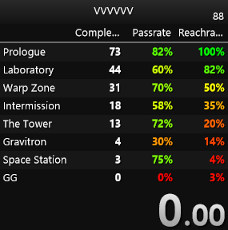

  

# LiveSplit.Splits component with more column types

## Installing
Download `LiveSplits.Splits.dll` file from releases and move it to `C:/Program Files (x86)/LiveSplit/Components` (or wherever you installed livesplit)

## Columns
- **Completed** - shows an amount of times the split has been completed
- **Passrate** - shows rate of the split getting completed relative to how many times the split has been reached
- **Reachrate** - shows rate of the split getting reached relative to total run attempts count

### Coloring
For the **passrate** and **reachrate** column types you can enable and disable text coloring:
- Setting the timing method to Real Time disables coloring
- Setting the timing method to Game Time enables coloring

Color changes from red at 0% to yellow at 50% to green at 100%

## Building from source

Building has same requirements as for [LiveSplit](https://github.com/LiveSplit/LiveSplit):
- [.NET 8.0 SDK](https://dotnet.microsoft.com/en-us/download/dotnet/8.0)
- [.NET Framework 4.8.1 Developer Pack](https://dotnet.microsoft.com/en-us/download/dotnet-framework/thank-you/net481-developer-pack-offline-installer) (Which should be preinstalled at most windows installations)

1. Clone repository
2. Replace files in `/lib/` as needed
3. Run `dotnet build`